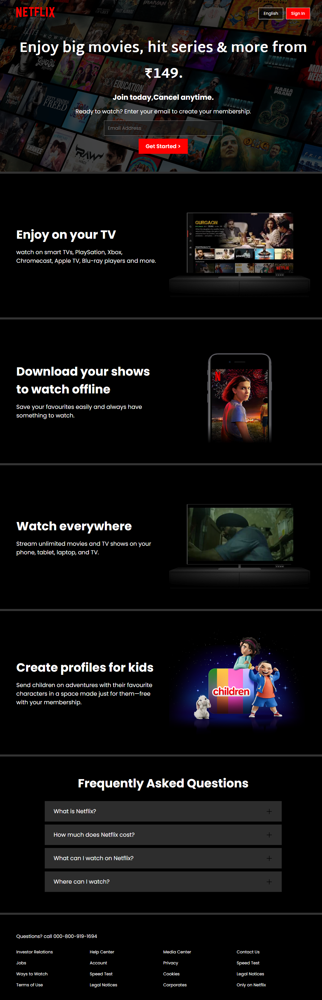

# 🎬 Netflix Clone


A static clone of the **Netflix landing page**, created using only **HTML and CSS**. The project emphasizes **responsive layouts, visual consistency**, and clean interface design — serving as practical experience in front-end development.

---
## ✨ Features

* Netflix-Inspired UI – Recreates the homepage design and layout

* Fully Responsive – Seamless viewing on desktop, tablet, and mobile

* Pure CSS Styling – Custom styles to match Netflix’s look and feel

* Static Build – Lightweight website without JavaScript

---

## 🎨 Design & Tech

1. HTML5
2. CSS3
  
---

## 📂 Installation & Setup
 1. Clone the repository:

    ```bash
     git clone https://github.com/codewithayana/portfolio.git
     cd portfolio

2. Open the folder in VS Code

3. Install Live Server extension

4. Right-click index.html → Open with Live Server

---

 
**screenshot of website**
  
    


---
💖 **how your support for this project by giving it a star on GitHub!**
